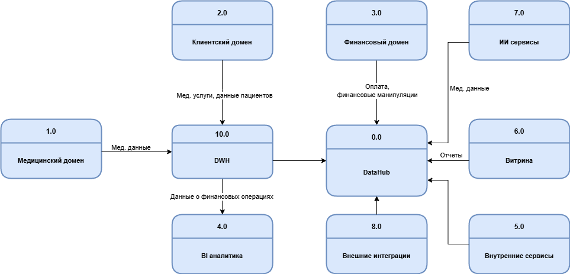

# Потоки данных между доменами

# Разделение системы на домены
1. Медицинский домен
   Медицинские карты, истории болезней, результаты анализов
2. Клиентский домен
   Клиентские данные, истории взаимодействий и обслуживания, CRM.
3. Финансовый домен
   Банковские операции, финансовая история, счета.
4. BI аналитика
   Аналитика, отчётность
5. Домен внутренних сервисов
   Данные по сотрудникам, инвентаризации и внутренним ресурсам больниц.
6. Витрина данных
   Конструирование и просмотр отчетов
7. ИИ-сервисы
8. Фармацевтические компании
9. Производство электроники для мед оборудования

# Логика разделения
Логика разделения на домены - по бизнес-направлениям.
Это позволит упростить управление и интеграцию новых бизнесов.
