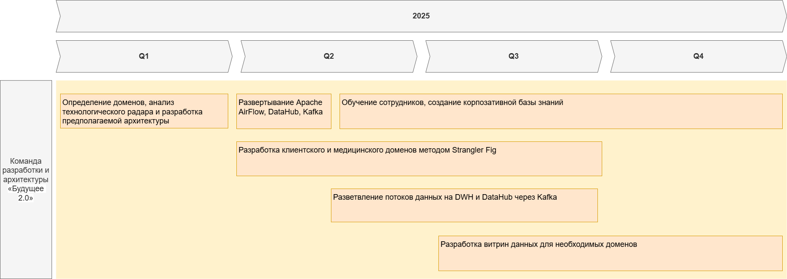

# Технический радар

|Кольца|ЯП и фреймворки|Инструменты        |Платформы     |Методы       |
|:-    |:-                                 |:-                 |:-            |:-           |
|Adopt |Python  Golang  Java    React   Kafka  |                   |              |Strangler Fig|
|Trial |PostgreSQL  S3 |DataHub             |              |Data Mesh    |
|Asset |                                   |Airflow            |              |             |
|Hold  |                                   |MS SQL Server  Apache Camel|Power Builder|             |

#  Роадмап изменений в технологическом ландшафте компании

